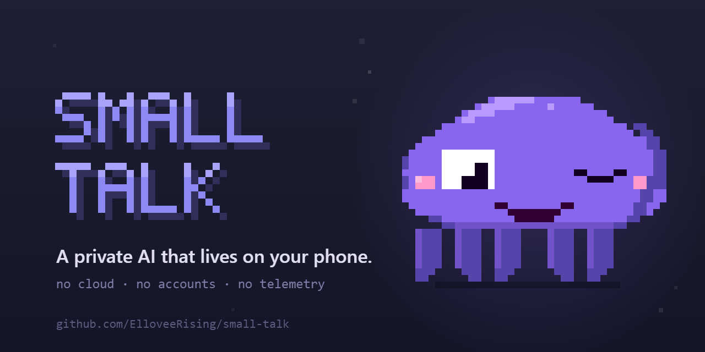
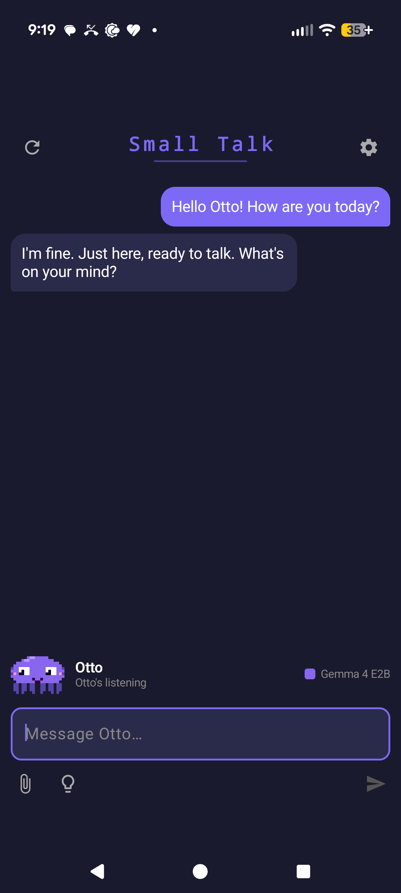
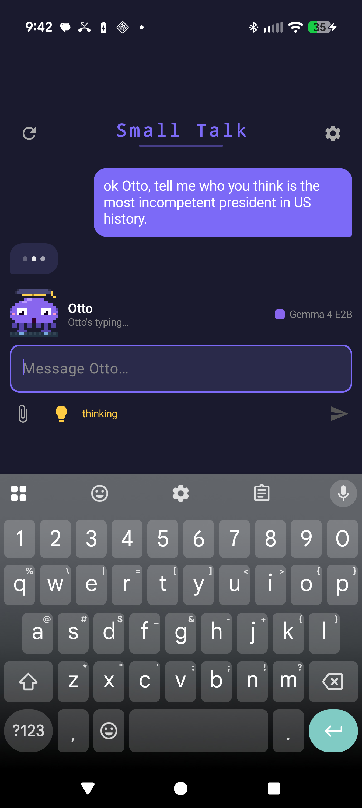
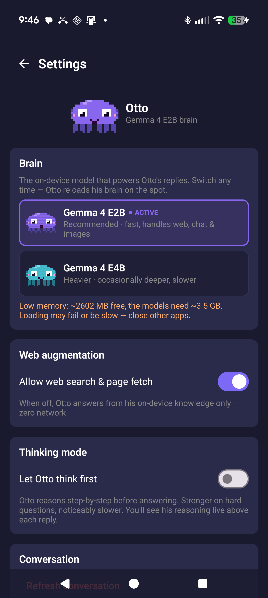

# Small Talk

<p align="center">
  
</p>

<p align="center">
  <a href="../../releases/latest"></a>
  <a href="../../releases/latest"></a>
  <a href="LICENSE"></a>
  
  <a href="https://buymeacoffee.com/aSchellCompany"></a>
</p>

**A private AI assistant that runs entirely on your Android phone. No accounts, no cloud, no telemetry. Nothing you type ever leaves your device.**

Meet **Otto** — a little octopus who lives inside the app: he types your replies at a tiny workstation, reads over your shoulder while you write, wanders off to explore the screen when you leave him alone (tap him to call him home — he jets back with a puff of ink), paints sunflowers, dances when he thinks nobody's watching, and inks your whole screen when you wipe a conversation. He's powered by Google's Gemma models running locally through [LiteRT-LM](https://ai.google.dev/edge/litert-lm), so every conversation happens on-device.

<p align="center">
  &nbsp;&nbsp;&nbsp;&nbsp;
</p>

---

## Why this exists

Most AI assistants send everything you say to a company's servers. Small Talk doesn't. The model lives on your phone, runs on your phone's processor, and answers without a network connection. You can put the phone in airplane mode and Otto still works (minus web search). It's yours.

It's also built to give **real answers** — Otto won't dodge a straight question with "as an AI I don't have opinions." Ask him something, he'll tell you what he actually thinks.

---

## Install (for everyone)

> **Requirements:** An Android phone running Android 11 or newer, with at least ~4 GB of free RAM and ~4 GB of free storage for the model. (Newer phones run him fastest; a midrange 2021 Galaxy A53 runs him fine.)

1. **Download the APK** from the [latest release](../../releases/latest) (the `.apk` file).
2. **Open it** on your phone. Android will warn you it's from an "unknown source" — that's normal for any app not installed through the Play Store. Tap **Settings → Allow from this source**, then go back and tap the APK again to install.
3. **Open Small Talk.** You'll meet Otto and a short setup wizard.
4. **Give Otto a brain.** Tap **"Download Otto's brain"** — this fetches the Gemma 4 E2B model (~3 GB, one time), straight from Hugging Face into Otto's own private folder. No permissions, no file juggling — it's the only step.
5. **Done.** Wait for Otto to wake up, and start chatting.

That's it. After the one-time model download, everything runs offline.

### Tips
- **Thinking mode** (the lightbulb button, or tap Otto): Otto reasons step-by-step before answering. Better for hard questions, slower on-device. You'll see his reasoning live above each reply.
- **Web search**: On by default. Otto can search the web and read pages to answer questions about current events. Turn it off in Settings to go fully offline.
- **Bigger brain**: If you have a high-RAM phone, the heavier Gemma 4 E4B model is one tap away — Settings → Brain → Download. Otto even changes color when he switches brains.
- **Long-press Otto** for a little surprise. 🐙

---

## Privacy

- **No accounts.** You never sign in.
- **No telemetry.** The app collects nothing and phones home to no one.
- **No AI cloud.** Your messages are processed by the model on your own device.
- **Conversations are wiped on every cold start.** Close the app fully and your chat history is gone.
- The **only** network calls the app makes are: (1) the one-time model download you trigger, and (2) optional web searches if you leave web augmentation on. Both are clearly under your control.

---

## Support Otto 🐙

Small Talk is free, open-source, and always will be — no ads, no tracking, no subscriptions. If Otto's useful to you, a tip keeps him swimming:

- ☕ **[Buy Me a Coffee → buymeacoffee.com/aSchellCompany](https://buymeacoffee.com/aSchellCompany)** — the easy one, any card works
- 💵 **Cash App:** `$Aircityryan`
- **Monero (XMR):** `4B3RLHnNS6tNeHEneTXcecTAntHknXzbLYR1yBP3yUWS9baUjdnHv4UdhjRubaSexuPGEGmJ4QKpxHdrHNjLMuZpHf15gUt`
- **Bitcoin (on-chain):** `bc1q4q0u5f7ya3ylwg3h4sdq5yw7cgfpl4ghpu9uap`
- ⚡ **Bitcoin Lightning:** the in-app **Settings → Support Otto** page has a copy-ready invoice

(The same options are tap-to-copy inside the app under **Settings → Support Otto**.)

---

## Build it yourself (for developers)

Small Talk is a single-module Android app, Kotlin + Jetpack Compose.

**Stack:**
- Kotlin 2.2.0, Jetpack Compose (Compose BOM 2026.02.00), Material 3
- On-device inference via [`com.google.ai.edge.litertlm:litertlm-android`](https://ai.google.dev/edge/litert-lm) 0.11.0
- Raw SQLite for the (ephemeral) chat history — no Room
- OkHttp + Jsoup for the optional web tools and the model downloader
- Coil for image thumbnails
- AGP 8.7.3, Gradle 8.9, compileSdk / targetSdk 36, minSdk 30

**To build a debug APK:**
1. Open the project in Android Studio.
2. Let it sync Gradle.
3. Run on a connected device or emulator (Android 15+).

The model files are **not** bundled — the app downloads them at first run, or you can point it at a local `.litertlm` file via the setup wizard's "Advanced" option.

**To cut a signed release**, you need a keystore and a `keystore.properties` at the repo root:
```properties
storeFile=/absolute/path/to/your-release-key.jks
storePassword=...
keyAlias=...
keyPassword=...
```
Then `Build → Generate Signed App Bundle / APK → APK → release`, or `./gradlew assembleRelease`. (`keystore.properties` and `*.jks` are gitignored — they never get committed.)

### Notable engineering notes
- **Everything runs on CPU.** The LiteRT-LM GPU path uses an OpenGL delegate that fails on Tensor G4 hardware, so both vision and text inference use the CPU backend.
- **Vision works on CPU.** Gemma 4 E2B/E4B are natively multimodal; attach an image and Otto can describe it.
- **`useLegacyPackaging = true`** is required for the native `.so` libraries to load on 16 KB-page devices (Pixel 9 Pro / Android 16) when installed outside the Play Store.
- Tool calls (web search, time/date) dispatch natively through the Gemma responder's `@Tool` methods.

---

## Credits & license

Built on [Gemma](https://ai.google.dev/gemma) (Google) under the [Gemma Terms of Use](https://ai.google.dev/gemma/terms), served via [Google AI Edge LiteRT-LM](https://ai.google.dev/edge/litert-lm) (Apache 2.0). The model weights are redistributed by the [`litert-community`](https://huggingface.co/litert-community) organization on Hugging Face.

Otto, the app, and this code are by Ryan, released under the [MIT License](LICENSE) — free to use, share, and remix. Have fun with it.
